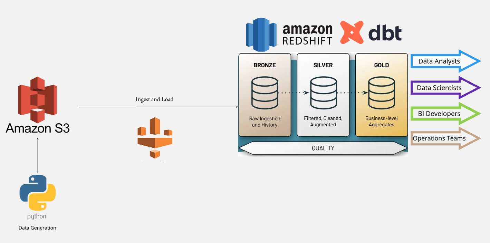

# Banking Data Warehouse Pipeline

## Project Overview
This project demonstrates an end-to-end data pipeline specifically designed for banking data using AWS and dbt. The goal is to ingest, process, and analyze banking data efficiently, catering to various data consumers such as Data Analysts, Data Scientists, BI Developers, and Operations Teams.

## Architecture
1. **Data Generation:** Using Python scripts to generate banking data.
2. **Data Storage:** Storing generated data in Amazon S3.
3. **Ingestion and Loading:** Using AWS Glue to ingest and load data from S3 into Amazon Redshift.
4. **Data Transformation:** Utilizing dbt (data build tool) to transform data within Amazon Redshift.
    - **Bronze Layer:** Raw ingestion and history.
    - **Silver Layer:** Filtered, cleaned, and augmented data.
    - **Gold Layer:** Business-level aggregates.

## Technologies Used
- **AWS S3**: For scalable storage.
- **AWS Glue**: For ETL operations.
- **Amazon Redshift**: For data warehousing.
- **dbt**: For data transformation and modeling.
- **Python**: For data generation scripts.

